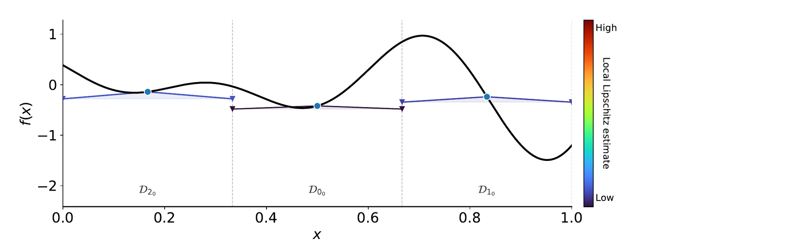

# HALO

**Paper:** [Journal version](https://doi.org/10.1007/s10898-025-01555-9) | [arXiv preprint](https://arxiv.org/abs/2211.04129)

HALO (Hybrid Adaptive Lipschitzian Optimization) is a deterministic partition based global optimization algorithm for box constrained black box problems of the form

```math
\min_{x} f(x)
\quad \text{subject to} \quad x \in D,
```

where

```math
D = \left\{x \in \mathbb{R}^N : l \leq x \leq u \right\}.
```

The method combines partition based global search with adaptive estimates of the local Lipschitz constants to compute lower bounds and drive the algorithm towards global minimizers. HALO is coupled with local optimization routines from the `scipy.optimize` library to speed up convergence, and it provides a variable importance ranking to assist problem interpretation based on the approximate gradients collected during the search.

## Notation

The feasible set is denoted by $D \subset \mathbb{R}^N$, where $N$ is the dimension of the problem.

At iteration $k$, the domain is partitioned into subregions indexed by the set $I_k$. For each index $i_k \in I_k$, the corresponding partition is denoted by $D_{i_k}$.

The centroid of partition $D_{i_k}$ is denoted by $x_{i_k}$, while $l_{i_k}$ and $u_{i_k}$ denote its lower and upper bounds, respectively.

HALO builds an approximate gradient $\widetilde{\nabla} f(x_{i_k})$ around each centroid $x_{i_k}$ using only the points sampled so far by the algorithm. This quantity is used to estimate the local behavior of the objective function inside each partition.

## Adaptive estimate of the local Lipschitz constants

In Lipschitz optimization, lower bounds are used to guide the search toward regions that are more likely to contain a global minimizer. A single global estimate, however, may fail to capture the local behavior of the objective function inside a specific partition. HALO addresses this point by associating an adaptive local Lipschitz estimate with each partition.

The adaptive estimate used by HALO is

```math
\widetilde{L}_{i_k}
=
\alpha_{i_k}\widetilde{L}_k
+
(1-\alpha_{i_k})\left\|\widetilde{\nabla} f(x_{i_k})\right\|.
```

Here, $\alpha_{i_k}$ is a weight that determines how much the estimate relies on global information versus local information inside partition $D_{i_k}$. It is defined as

```math
\alpha_{i_k} = \frac{\left\|u_{i_k} - l_{i_k}\right\|}{\sqrt{N}},
\qquad
\alpha_{i_k} \in (0,1),
```

so that larger partitions receive a larger weight on the global term, while smaller partitions place more emphasis on the local term.

The quantity $\widetilde{L}_k$ is the global Lipschitz estimate at iteration $k$, defined as

```math
\widetilde{L}_k = \max_{i_k \in I_k} \left\|\widetilde{\nabla} f(x_{i_k})\right\|.
```

In other words, $\widetilde{L}_k$ is the largest approximate gradient norm observed over the current set of partitions.

This estimate is the core mechanism of HALO. When a partition is large, the local information around its centroid is less reliable, so the estimate places more emphasis on the global Lipschitz estimate at iteration $k$. When a partition becomes smaller, the approximation around its centroid becomes more informative, so the estimate places more emphasis on the norm of the approximate gradient evaluated at that centroid.
In this way, HALO balances global and local information in a self adaptive manner.

## Lower bounds and partition selection

Given $\widetilde{L}_{i_k}$, HALO computes a lower bound for each partition. These lower bounds are then used to decide which regions should be explored next.

The selection strategy is based on three simple ideas.

1. HALO selects the partition with the smallest lower bound, since this is the partition that appears most promising from a global optimization perspective.

2. HALO always keeps track of the partition containing the current best objective value. This ensures that the search does not lose focus on the best solution found so far.

3. HALO also considers the largest partitions and selects the most promising one among them according to the lower bound. This preserves exploration and supports the global search by preventing the algorithm from focusing too early only on very small regions.

This combination allows HALO to balance exploitation of promising regions with continued exploration of the domain.

## Adaptive gradient approximation

HALO does not assume that exact gradients are available.

Instead, it builds $\widetilde{\nabla} f(x_{i_k})$ from the points sampled during the partitioning process. These approximate gradients are used both to construct $\widetilde{L}_{i_k}$ and to extract information about the sensitivity of the objective function.

This means that the search itself produces the information needed for both optimization and interpretation.

## Hybrid local optimization

HALO can be coupled with local optimization routines from `scipy.optimize.minimize`. The currently supported methods are `L-BFGS-B`, `Nelder-Mead`, `TNC`, and `Powell`.

The local optimizer is used only as a refinement step. It does not replace the global partition based search.

A local search is triggered when a selected partition satisfies the selection conditions described above and when

```math
\frac{\left\|u_{i_k} - l_{i_k}\right\|}{2} \leq \beta.
```

The parameter $\beta$ only controls when local refinement is allowed to start. It is not part of the adaptive local Lipschitz estimate.

In HALO, local optimization is used as a refinement near promising centroids rather than as the main search mechanism. For this reason, the algorithm is robust with respect to $\beta$. The local search helps speed up convergence, while the global behavior of the method is still driven by the partitioning strategy and the lower bounds induced by $\widetilde{L}_{i_k}$.

## Variable importance and interpretability

At the end of the search, we can rank the variables using the approximate gradients $\widetilde{\nabla} f(x_{i_k})$.

The variable importance is computed as

```math
\text{Variable Importance}
=
\frac{1}{|I_k|}
\sum_{i=1}^{|I_k|}
\widetilde{\nabla} f(x_{i_k}).
```

A final normalization step is then applied so that the variable importance vector sums to one.

This provides an interpretable summary of the directions in which the objective function has shown the highest sensitivity during the optimization process. As a result, HALO is not only a global optimization method, but also a tool that can help identify which variables matter most in the problem under study.

## Example 1D function



## Installation

Clone the repository:

```bash
git clone https://github.com/dannyzx/HALO.git
cd HALO
```

## Parameters

The `HALO` constructor has the following signature:

```python
HALO(f, bounds, max_feval, max_iter, beta, local_optimizer, verbose)
```

where:

* `f`: objective function to minimize. It must accept a point `x` and return a scalar value.
* `bounds`: NumPy array of shape `(N, 2)` containing the lower and upper bound for each variable.
* `max_feval`: maximum number of function evaluations allowed during the search.
* `max_iter`: maximum number of partitioning iterations. In practice, it can simply be set to a sufficiently large value, since the main effective stopping criterion is given by max_feval.
* `beta`: threshold controlling when local refinement is allowed to start. In practice, HALO is very robust with respect to this hyperparameter, and any values in between 1e-2 and 1e-5 generally work well
* `local_optimizer`: local optimization method used for refinement. Supported options are `L-BFGS-B`, `Nelder-Mead`, `TNC`, and `Powell`.
* `verbose`: boolean flag controlling whether progress information is printed during the run.

## Outputs

The `minimize()` method returns a dictionary containing the optimization history and the final solution.

```python
result = solver.minimize()
print(result.keys())
```

which gives:

```python
dict_keys([
    'F_history',
    'X_history',
    'F_history_global',
    'X_history_global',
    'C_history_global',
    'X_history_local',
    'count_local',
    'gradients',
    'sides',
    'tree',
    'neighbors',
    'best_feval',
    'best_f',
    'best_x'
])
```

The main outputs are:

* `F_history`: history of objective values evaluated during the search.
* `X_history`: history of sampled points evaluated during the search.
* `F_history_global`: history of objective values generated by the global partition based search.
* `X_history_global`: history of points generated by the global partition based search.
* `C_history_global`: history of points considered by the global partition based search in the normalized domain.
* `X_history_local`: history of points generated by the local optimization steps.
* `count_local`: number of local optimization calls performed during the run.
* `gradients`: approximate gradients collected during the search.
* `sides`: side lengths of the partitions explored by HALO.
* `tree`: tree structure associated with the partitioning process.
* `neighbors`: neighborhood information among partitions.
* `best_feval`: function evaluation at which the best solution was found.
* `best_f`: best objective value found.
* `best_x`: best point found.

## Quick example

Below is a minimal example showing how to define the Branin function and run HALO.

```python
import numpy as np
from halo import HALO  

def branin(x):
    x = np.asarray(x, dtype=float)
    x1, x2 = x[0], x[1]

    a = 1.0
    b = 5.1 / (4.0 * np.pi**2)
    c = 5.0 / np.pi
    r = 6.0
    s = 10.0
    t = 1.0 / (8.0 * np.pi)

    return a * (x2 - b * x1**2 + c * x1 - r)**2 + s * (1.0 - t) * np.cos(x1) + s


bounds = np.array([
    [-5.0, 10.0],
    [0.0, 15.0],
])

solver = HALO(
    f=branin,
    bounds=bounds,
    max_feval=500,
    max_iter=200,
    beta=1e-3,
    local_optimizer="L-BFGS-B",
    verbose=True,
)

result = solver.minimize()

print(result)
```

## Citation

If you use HALO in your work, please cite:

```bibtex
@article{d2026efficient,
  title={An efficient global optimization algorithm with adaptive estimates of the local Lipschitz constants},
  author={D’Agostino, Danny},
  journal={Journal of Global Optimization},
  pages={1--32},
  year={2026},
  publisher={Springer}
}
```
